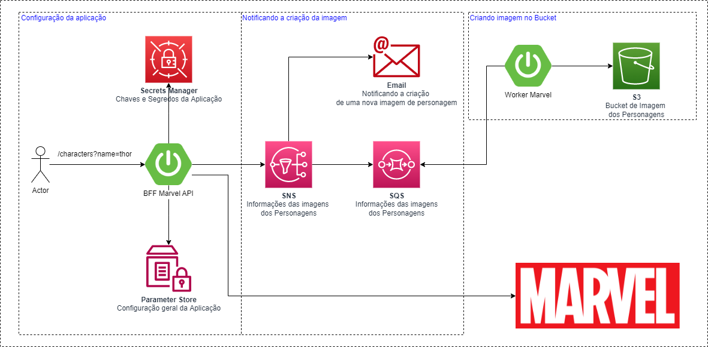
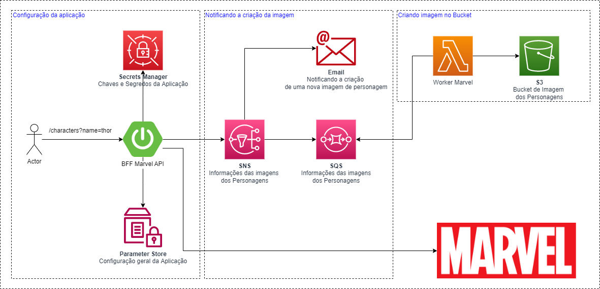
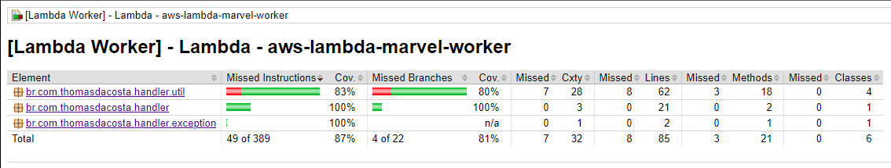
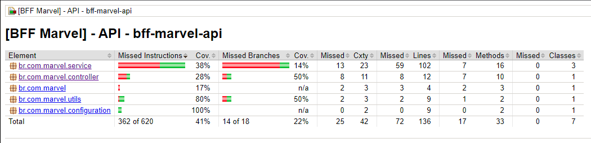
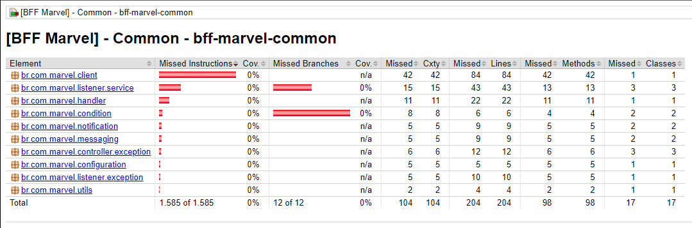

# BFF Marvel API - 1.0.0

BFF (Backends For Frontends) desenvolvido em Spring Boot que efeuta o acesso as API´s Oficiais da Marvel e busca o personagem, HQ´s e eventos de acordo com o nome pesquisado.

# Solução 1

Utilizando um Worker em Spring para obter as mensagens de uma fila SQS e gravar as imagens em um bucket S3.



# Solução 2

Utilizando um AWS Lambda para obter as mensagens de uma fila SQS e gravar as imagens em um bucket S3.



# 1 - Introdução

## Tecnologias

- Java 11
- Spring Boot Servlet
- Spring Cloud AWS
- LocalStack

## Diretórios

- **01-arquitetura** - Arquitetura da aplicação<br/>
- **02-aws** - Arquivos relacionados a implantação no ambiente da AWS ou LocalStack<br/>
- **03-localstack** - Docker Compose para execução do LocalStack<br/>
- **04-postman** - Arquivos com request dos Postman<br/>
- **05-swagger** - Swagger da API da Marvel<br/>
- **bff-marvel** - API desenvolvida em Spring Boot

## Gerando o client da API da Marvel

Efetuar o cadastro no portal para obter as chaves e acesso a API da Marvel:

- https://developer.marvel.com/

Será necessário gerar um hash com as chaves da API da Marvel para efetuar as chamadas. Na documentação do Portal da Marvel existe a explicação. Sugestão de site que gera hash MD5:

- https://www.md5hashgenerator.com/

Baixar o Swagger do site abaixo:

- https://speca.io/speca/marvel-public-api-v1

Com o Swagger, gerar o código da aplicação através dos seguintes comandos:

```sh
wget https://repo1.maven.org/maven2/io/swagger/codegen/v3/swagger-codegen-cli/3.0.29/swagger-codegen-cli-3.0.29.jar -O swagger-codegen-cli.jar
java -jar swagger-codegen-cli.jar generate -i marvel-public-api-v1-swagger.json -l spring --library spring-cloud -o marvel
```

# 2 - LocalStack

Para habilitar o LocalStack, usar o seguinte profile:

```
-Dspring.profiles.active=localstack
```
Além disso a região padrão deve ser sempre **us-east-1** para testar com LocalStack.

Crie um profile separado com o AWS Cli:

```
aws configure --profile localstack

AWS Access Key ID [None]: test
AWS Secret Access Key [None]: test
Default region name [None]: us-east-1
Default output format [None]:
```

## SQS e SNS

Para funcionar o envio de mensagens para o SQS e notificações para o SNS com LocalStack os endpoints devem ser configurados da seguinte forma:

```
cloud:
  aws:
    sqs:
      endpoint: http://localhost:4566
    sns:
      endpoint: http://localhost:4566 
```

Principais comandos do SQS com AWS Cli:

```
aws --endpoint http://localhost:4566 --profile localstack sqs create-queue --queue-name marvelThumbnailImageQueue
aws --endpoint http://localhost:4566 --profile localstack sqs send-message --queue-url http://localhost:4566/queue/marvelThumbnailImageQueue --message-body "Mensagem de Teste do SQS"
aws --endpoint http://localhost:4566 --profile localstack sqs receive-message --queue-url http://localhost:4566/queue/marvelThumbnailImageQueue
aws --endpoint http://localhost:4566 --profile localstack sqs receive-message --queue-url http://localhost:4566/queue/marvelThumbnailImageQueue --max-number-of-messages 10
aws --endpoint http://localhost:4566 --profile localstack sqs purge-queue --queue-url http://localhost:4566/queue/marvelThumbnailImageQueue
```

Principais comandos do SNS com AWS Cli:

```
aws --endpoint http://localhost:4566 --profile localstack sns create-topic --name marvelThumbnailImageNotification
aws --endpoint http://localhost:4566 --profile localstack sns list-topics
aws --endpoint http://localhost:4566 --profile localstack sns subscribe --topic-arn arn:aws:sns:us-east-1:000000000000:marvelThumbnailImageNotification --protocol email --notification-endpoint name@email.com
aws --endpoint http://localhost:4566 --profile localstack sns subscribe --topic-arn arn:aws:sns:us-east-1:000000000000:marvelThumbnailImageNotification --protocol sqs --notification-endpoint http://localhost:4566/queue/marvelThumbnailImageQueue
aws --endpoint http://localhost:4566 --profile localstack sns list-subscriptions
aws --endpoint http://localhost:4566 --profile localstack sns publish --topic-arn arn:aws:sns:us-east-1:000000000000:marvelThumbnailImageNotification --message "Mensagem de Teste do SNS"
```

## S3

Para funcionar a escrita e leitura de arquivos usando S3 com LocalStack o endpoint deve ser configurado da seguinte forma:

```
cloud:
  aws:
    s3:
      endpoint: http://s3.localhost.localstack.cloud:4566/
```

## AWS Secrets Manager e AWS Parameter Store

Para execução com o LocalStack é necessário mudar o endpoint do Secrets Manager e do Parameter Store no arquivo **bootstrap.yml** para o endereço do LocalStack:

```
aws:
  secretsmanager:
    enabled: true
    endpoint: http://localhost:4566
  paramstore:
    enabled: true
    endpoint: http://localhost:4566
```

Comandos para criação das chaves usando o AWS Cli estão localizadas no diretório **scripts**.

# 3 - Docker

## Gerando a Imagem

Use o comando abaixo para gerar a imagem Docker:

```
mvn spring-boot:build-image -Dspring-boot.build-image.imageName=bff-marvel-api:1.0.0
```

Executando a imagem com LocalStack

```
docker run -e "SPRING_PROFILES_ACTIVE=localstack" -e "AWS_ACCESS_KEY_ID=localstack" -e "AWS_SECRET_KEY=localstack" -e "AWS_REGION=sa-east-1" -p 8080:8080 bff-marvel-api:1.0.0
```

Executando a imagem em Produção

```
docker run -e "SPRING_PROFILES_ACTIVE=production" -e "AWS_ACCESS_KEY_ID=production" -e "AWS_SECRET_KEY=production" -e "AWS_REGION=sa-east-1" -p 8080:8080 bff-marvel-api:1.0.0
```

## Acessando o LocalStack

Para usar o LocalStack no AWS Secret Manager e no AWS Parameter Store usar as seguintes configurações:

```
aws:
  secretsmanager:
    enabled: true
    endpoint: http://host.docker.internal:4566
  paramstore:
    enabled: true
    endpoint: http://host.docker.internal:4566
```

## S3 com LocalStack e Docker

Ainda não está funcionando corretamente!!!

## Docker MySQL

```
docker run -p 3306:3306 -e "MYSQL_ROOT_PASSWORD=mypassword" mysql
```

# 4 - AWS Lambda

Para usa o AWS Lambda para testes locais, devemos ajustar o **docker-compose.yml** do LocalStack configurando a seguinte variável:

```
LAMBDA_EXECUTOR=local
```

# 5 - Code Coverage

- aws-lambda-marvel-worker:


- bff-marvel-api:


- bff-marvel-common:


- bff-marvel-worker:


# A - Roadmap - ToBe

### AWS

- KMS no Parameter Store
- SNS com criptografia
- SQS com criptografia
- RDS com MySQL e Spring Data
- DynamoDB
- DLQ para o SQS
- Utilizar SES com LocalStack
- CloudFormation com LocalStack
- CloudWatch logs com LocalStack
- CDK com Spring Boot
- Logs da aplicação no CloudWatch
- Substiuir Worker pelo Lambda
- ElastiCache
- Cognito para usuários da aplicação

### Spring

- Spring Reativo
- HATEOAS com Feign Client
- Autenticação e Autorização
 
### Funcionalidades

- Criar os endpoints restantes (comics, stories, events e series) para o Character
- Incluir novos personagens
- Atualizar persongens
- Excluir personagens

### Testes

- Cobertura total de testes unitários
- Usar o avançado do Wiremock com latência de rede e simular autenticação
- Testcontainers - https://www.testcontainers.org/

### Observability

- Kiali
- Jaeger

### Outros

- gRPC
- Integração com Frontend
- CI/CD
- Keycloack

---

Thomás da Costa - [https://thomasdacosta.com.br](https://thomasdacosta.com.br)
